# 모듈러 아키텍처 설계

## 설계 철학

- **공통모듈**: 모든 병원이 사용하는 핵심 기능으로, 앱의 기반을 구성
- **전문모듈**: 진료과별 특화 기능으로, 플러그인처럼 탈부착 가능
- **선택적 구성**: 병원이 자신의 진료과에 맞는 전문모듈만 선택하여 앱 구성
- **기술 스택**: Flutter (모바일), NestJS (백엔드), PostgreSQL (DB), Redis (캐시/큐)

핵심 목표는 코드 재사용성을 극대화하면서 각 병원의 특수성을 수용하는 것이다. 공통모듈은 한 번 개발하고 모든 병원에 배포하며, 전문모듈은 독립적으로 개발·테스트·배포할 수 있어야 한다.

## 모듈 시스템 구조

```mermaid
graph TD
    subgraph "Core Layer (공통모듈)"
        AUTH[auth<br/>인증/사용자관리]
        APPT[appointment<br/>예약시스템]
        QUEUE[queue<br/>대기열관리]
        NOTIF[notification<br/>알림/메시징]
        BILL[billing<br/>수납/결제]
        MR[medical-record<br/>환자기록뷰어]
        INFO[hospital-info<br/>병원정보]
        CONTENT[content<br/>콘텐츠관리]
        DASH[dashboard<br/>관리자대시보드]
    end

    subgraph "Plugin Layer (전문모듈)"
        IM[internal-medicine<br/>내과]
        ORTHO[orthopedics<br/>정형외과]
        DERM[dermatology<br/>피부과]
        PEDS[pediatrics<br/>소아과]
        OPTH[ophthalmology<br/>안과]
        DENT[dental<br/>치과]
        OB[obstetrics<br/>산부인과]
        PSY[psychiatry<br/>정신건강의학과]
    end

    subgraph "Hospital App (병원별 조합)"
        APP_A[병원 A<br/>내과 + 피부과]
        APP_B[병원 B<br/>소아과 + 산부인과]
        APP_C[병원 C<br/>정형외과 + 안과 + 치과]
    end

    AUTH --> APP_A
    AUTH --> APP_B
    AUTH --> APP_C
    APPT --> APP_A
    APPT --> APP_B
    APPT --> APP_C

    IM --> APP_A
    DERM --> APP_A
    PEDS --> APP_B
    OB --> APP_B
    ORTHO --> APP_C
    OPTH --> APP_C
    DENT --> APP_C
```



## 공통모듈 목록 (9개)

모든 병원 앱에 기본 포함되는 핵심 모듈이다.

| 모듈 | 설명 | 주요 기능 |
|------|------|-----------|
| `auth` | 인증/사용자관리 | 로그인, 회원가입, 소셜 로그인, 보호자 연동, 권한 관리 |
| `appointment` | 예약시스템 | 예약 생성/변경/취소, 슬롯 관리, 예약 캘린더 |
| `queue` | 대기열관리 | 실시간 대기 현황, 순번 알림, 대기 시간 예측 |
| `notification` | 알림/메시징 | 푸시 알림, SMS 발송, 1:1 메시지, 알림 이력 |
| `billing` | 수납/결제 | 진료비 조회, 온라인 결제, 영수증 발급, 보험 청구 내역 |
| `medical-record` | 환자기록뷰어 | 진료 타임라인, 검사 결과 조회, 처방 이력 |
| `hospital-info` | 병원정보 | 병원 소개, 진료 시간, 위치/지도, 의료진 소개 |
| `content` | 콘텐츠관리 | 공지사항, 건강 정보, 이벤트, FAQ |
| `dashboard` | 관리자대시보드 | 통계 리포트, 예약 현황, 환자 현황, 매출 집계 |

## 전문모듈 목록 (8개 예시)

병원이 진료과에 맞게 선택적으로 활성화하는 모듈이다.

| 모듈 | 대상 진료과 | 핵심 기능 |
|------|-------------|-----------|
| `internal-medicine` | 내과 | 만성질환 관리, 혈압/혈당 트래킹, 정기검진 리마인더, 복약 관리 |
| `orthopedics` | 정형외과 | 재활 운동 가이드, 수술 전후 체크리스트, 통증 일지, X-ray 뷰어 연동 |
| `dermatology` | 피부과 | 피부 사진 촬영/비교, 치료 전후 갤러리, 시술 이력 관리 |
| `pediatrics` | 소아과 | 성장 차트, 예방접종 스케줄, 보호자 전용 UI, 발달 체크 |
| `ophthalmology` | 안과 | 시력 검사 기록, 렌즈 처방 관리, 안압 추적 |
| `dental` | 치과 | 치아 차트, 스케일링 리마인더, 치료 계획 시각화 |
| `obstetrics` | 산부인과 | 임신 주수 트래커, 태아 검진 기록, 산전 체크리스트 |
| `psychiatry` | 정신건강의학과 | 기분 트래커, 상담 일지, 약물 반응 기록, 수면 일지 |

## 모듈 인터페이스 설계

전문모듈이 공통모듈과 연결되는 인터페이스 규약이다. 모든 전문모듈은 이 규약을 준수해야 한다.

### Flutter: 모듈 등록 패턴

각 전문모듈은 `SpecialtyModule` 인터페이스를 구현한다.

```dart
// 모듈 인터페이스 규약
abstract class SpecialtyModule {
  String get moduleId;
  String get displayName;
  List<String> get requiredCommonModules;  // 의존 공통모듈 선언

  // 라우트 등록
  List<GoRoute> get routes;

  // 네비게이션 메뉴 항목
  List<NavigationItem> get navigationItems;

  // 전역 Provider 등록
  List<ProviderBase> get providers;

  // 모듈 초기화 로직
  Future<void> initialize(ModuleContext context);
}

// 전문모듈 구현 예시 (내과)
class InternalMedicineModule implements SpecialtyModule {
  @override
  String get moduleId => 'internal-medicine';

  @override
  List<String> get requiredCommonModules => [
    'auth',
    'medical-record',
    'notification',
  ];

  @override
  List<GoRoute> get routes => [
    GoRoute(path: '/chronic-disease', builder: (_, __) => ChronicDiseaseScreen()),
    GoRoute(path: '/vitals', builder: (_, __) => VitalsTrackingScreen()),
    GoRoute(path: '/medications', builder: (_, __) => MedicationScreen()),
  ];
}
```

### NestJS: 모듈 등록 패턴

```typescript
// 전문모듈 인터페이스 규약
interface SpecialtyModuleConfig {
  moduleId: string;
  requiredCommonModules: string[];
}

// DynamicModule forRoot/forFeature 패턴
@Module({})
export class InternalMedicineModule {
  static forRoot(config: InternalMedicineConfig): DynamicModule {
    return {
      module: InternalMedicineModule,
      imports: [
        // 공통모듈 의존성 주입
        AuthModule,
        MedicalRecordModule,
        NotificationModule,
      ],
      controllers: [
        ChronicDiseaseController,
        VitalsController,
        MedicationController,
      ],
      providers: [
        InternalMedicineService,
        VitalsTrackingService,
        MedicationReminderService,
        { provide: INTERNAL_MEDICINE_CONFIG, useValue: config },
      ],
      exports: [InternalMedicineService],
    };
  }
}

// 병원별 앱 모듈에서 활성 모듈 등록
@Module({
  imports: [
    // 공통모듈 (항상 포함)
    AuthModule.forRoot(),
    AppointmentModule.forRoot(),
    QueueModule.forRoot(),
    NotificationModule.forRoot(),
    BillingModule.forRoot(),
    MedicalRecordModule.forRoot(),
    HospitalInfoModule.forRoot(),
    ContentModule.forRoot(),
    DashboardModule.forRoot(),
    // 전문모듈 (병원 설정에 따라 선택)
    ...ModuleLoader.loadSpecialtyModules(modulesConfig),
  ],
})
export class AppModule {}
```

### DB: 전문모듈 테이블 설계 규약

전문모듈의 테이블은 반드시 공통 `patients` 테이블을 FK로 참조한다.

```sql
-- 공통 환자 테이블 (common 모듈)
CREATE TABLE patients (
  id UUID PRIMARY KEY DEFAULT gen_random_uuid(),
  user_id UUID NOT NULL REFERENCES users(id),
  hospital_id UUID NOT NULL REFERENCES hospitals(id),
  created_at TIMESTAMPTZ DEFAULT NOW()
);

-- 전문모듈 테이블 예시 (내과 - 활력징후 트래킹)
CREATE TABLE im_vitals (
  id UUID PRIMARY KEY DEFAULT gen_random_uuid(),
  patient_id UUID NOT NULL REFERENCES patients(id) ON DELETE CASCADE,
  blood_pressure_systolic INTEGER,
  blood_pressure_diastolic INTEGER,
  blood_glucose DECIMAL(5,1),
  measured_at TIMESTAMPTZ NOT NULL,
  created_at TIMESTAMPTZ DEFAULT NOW()
);

-- Redis: 대기열 및 실시간 데이터 (공통 queue 모듈 활용)
-- Key 패턴: queue:{hospital_id}:{department_id}
-- Key 패턴: vitals:realtime:{patient_id}
```

## Flutter 모듈 구조

```
lib/
├── core/                          # 공통 인프라 (DI, 라우터, 네트워크)
│   ├── di/
│   ├── router/
│   ├── network/
│   └── utils/
├── modules/
│   ├── common/                    # 공통모듈들
│   │   ├── auth/
│   │   │   ├── data/
│   │   │   ├── domain/
│   │   │   └── presentation/
│   │   ├── appointment/
│   │   ├── queue/
│   │   ├── notification/
│   │   ├── billing/
│   │   ├── medical_record/
│   │   ├── hospital_info/
│   │   ├── content/
│   │   └── dashboard/
│   └── specialty/                 # 전문모듈들 (선택적 포함)
│       ├── internal_medicine/
│       │   ├── data/
│       │   ├── domain/
│       │   ├── presentation/
│       │   └── internal_medicine_module.dart
│       ├── orthopedics/
│       ├── dermatology/
│       ├── pediatrics/
│       ├── ophthalmology/
│       ├── dental/
│       ├── obstetrics/
│       └── psychiatry/
├── config/
│   └── hospital_config.dart       # 병원별 활성 모듈 설정
└── main.dart
```

## NestJS 모듈 구조

```
src/
├── common/                        # 공통 인프라 (미들웨어, 가드, 인터셉터)
│   ├── guards/
│   ├── interceptors/
│   ├── decorators/
│   └── filters/
├── modules/
│   ├── common/                    # 공통모듈
│   │   ├── auth/
│   │   ├── appointment/
│   │   ├── queue/
│   │   ├── notification/
│   │   ├── billing/
│   │   ├── medical-record/
│   │   ├── hospital-info/
│   │   ├── content/
│   │   └── dashboard/
│   └── specialty/                 # 전문모듈 (동적 로딩)
│       ├── internal-medicine/
│       ├── orthopedics/
│       ├── dermatology/
│       ├── pediatrics/
│       ├── ophthalmology/
│       ├── dental/
│       ├── obstetrics/
│       └── psychiatry/
├── config/
│   └── modules.config.ts          # 병원별 활성 모듈 목록
└── app.module.ts
```

## 모듈 활성화 설정 예시

### Flutter (hospital_config.dart)

```dart
// config/hospital_config.dart

enum CommonModules { auth, appointment, queue, notification, billing, medicalRecord, hospitalInfo, content, dashboard }
enum SpecialtyModules { internalMedicine, orthopedics, dermatology, pediatrics, ophthalmology, dental, obstetrics, psychiatry }

class HospitalConfig {
  static const String hospitalId = 'hospital-uuid-here';
  static const String hospitalName = '예시 내과의원';

  // 공통모듈: 전체 활성화
  static const List<CommonModules> enabledCommonModules = CommonModules.values;

  // 전문모듈: 병원 진료과에 맞게 선택
  static const List<SpecialtyModules> enabledSpecialtyModules = [
    SpecialtyModules.internalMedicine,
    SpecialtyModules.dermatology,
  ];
}

// main.dart에서 모듈 등록
void main() async {
  final moduleRegistry = ModuleRegistry();

  // 공통모듈 등록 (항상 전체)
  moduleRegistry.registerCommonModules(HospitalConfig.enabledCommonModules);

  // 전문모듈 등록 (선택적)
  moduleRegistry.registerSpecialtyModules(HospitalConfig.enabledSpecialtyModules);

  runApp(MyApp(moduleRegistry: moduleRegistry));
}
```

### NestJS (modules.config.ts)

```typescript
// config/modules.config.ts
export const modulesConfig = {
  hospitalId: 'hospital-uuid-here',
  specialty: {
    internalMedicine: { enabled: true },
    orthopedics: { enabled: false },
    dermatology: { enabled: true },
    pediatrics: { enabled: false },
    ophthalmology: { enabled: false },
    dental: { enabled: false },
    obstetrics: { enabled: false },
    psychiatry: { enabled: false },
  },
};

// ModuleLoader: 설정에 따라 동적으로 모듈 로딩
export class ModuleLoader {
  static loadSpecialtyModules(config: typeof modulesConfig): DynamicModule[] {
    const modules: DynamicModule[] = [];
    if (config.specialty.internalMedicine.enabled) {
      modules.push(InternalMedicineModule.forRoot(config.specialty.internalMedicine));
    }
    if (config.specialty.dermatology.enabled) {
      modules.push(DermatologyModule.forRoot(config.specialty.dermatology));
    }
    // ... 나머지 전문모듈
    return modules;
  }
}
```

## 모듈 확장 가이드

새로운 전문모듈(예: `cardiology` - 심장내과)을 추가하는 절차이다.

### 1단계: Flutter 전문모듈 생성

필요한 파일 구조:

```
lib/modules/specialty/cardiology/
├── data/
│   ├── datasources/cardiology_remote_datasource.dart
│   ├── models/ecg_record_model.dart
│   └── repositories/cardiology_repository_impl.dart
├── domain/
│   ├── entities/ecg_record.dart
│   ├── repositories/cardiology_repository.dart
│   └── usecases/get_ecg_history_usecase.dart
├── presentation/
│   ├── screens/ecg_monitor_screen.dart
│   ├── widgets/ecg_chart_widget.dart
│   └── providers/cardiology_provider.dart
└── cardiology_module.dart          # SpecialtyModule 인터페이스 구현
```

### 2단계: NestJS 전문모듈 생성

```
src/modules/specialty/cardiology/
├── dto/
├── entities/
├── cardiology.controller.ts
├── cardiology.service.ts
└── cardiology.module.ts            # DynamicModule forRoot 구현
```

### 3단계: DB 마이그레이션 작성

- 전문모듈 테이블은 `cardiology_` 접두사 사용
- 반드시 `patients.id` FK 참조
- 마이그레이션 파일: `migrations/YYYYMMDD_create_cardiology_tables.sql`

### 4단계: 모듈 등록

- Flutter: `SpecialtyModules` enum에 `cardiology` 추가, `ModuleRegistry`에 등록 로직 추가
- NestJS: `modulesConfig`에 `cardiology` 항목 추가, `ModuleLoader`에 로딩 로직 추가
- `hospital_config.dart` / `modules.config.ts`에서 병원별 활성화 설정

### 인터페이스 준수사항

새 전문모듈이 반드시 지켜야 할 규약:

1. **Flutter**: `SpecialtyModule` 추상 클래스를 구현하고 `requiredCommonModules`를 명시할 것
2. **NestJS**: `forRoot(config)` 정적 메서드로 `DynamicModule`을 반환할 것
3. **DB**: 전용 테이블은 진료과 코드 접두사를 사용하고(`im_`, `ortho_`, `derm_` 등) `patients` FK를 참조할 것
4. **Redis**: 키 네이밍 패턴 `{module_id}:{hospital_id}:{resource_id}` 준수
5. **API**: 라우트 경로는 `/api/specialty/{module-id}/...` 패턴 사용
6. **테스트**: 유닛 테스트 커버리지 80% 이상 유지
