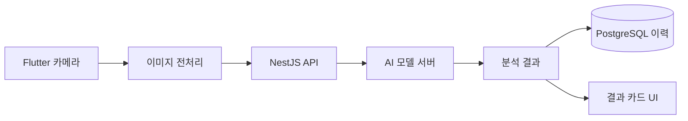
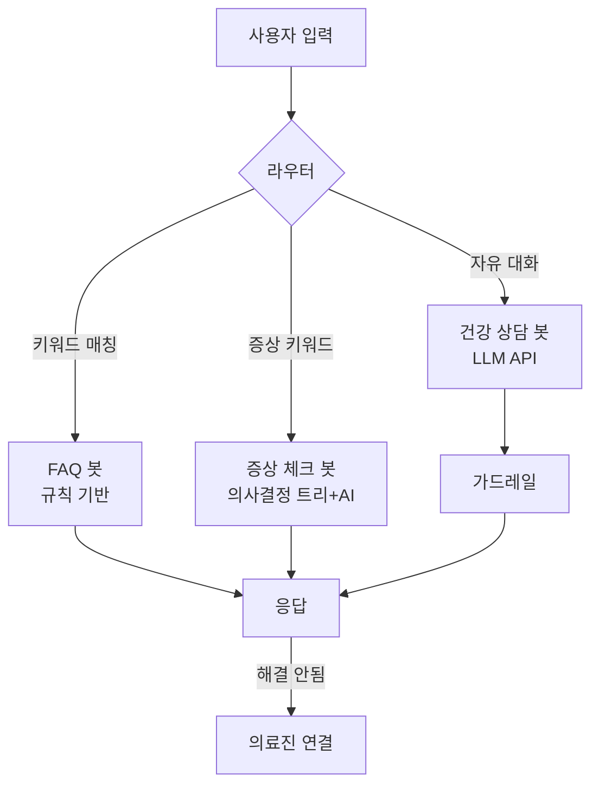

# 모바일 특화 기술 설계

## 1. AI 피부 분석 엔진

### 아키텍처



### 기술 스택

- **Flutter**: `camera` 패키지, `image` 패키지 (전처리)
- **AI 모델**: 2가지 옵션
  - **Option A**: Cloud API (Google Cloud Vision / AWS Rekognition) — 빠른 도입, 비용 발생
  - **Option B**: On-device TFLite (`tensorflow_lite_flutter`) — 오프라인 가능, 초기 개발 비용 높음
  - **추천**: Phase 2는 Cloud API로 빠르게 출시, Phase 3에서 On-device 전환
- **NestJS**: 이미지 업로드, 분석 결과 저장, 시계열 비교 API
- **PostgreSQL**: 분석 이력 테이블 (이미지URL, 분석결과JSON, 측정일)

### 분석 항목

피부타입, 트러블(여드름/홍조/색소침착), 수분도 추정, 모공, 주름

### 시계열 비교 설계

- 같은 환자의 이전 분석 결과와 diff 비교
- 결과는 JSON으로 저장, 수치 변화를 차트로 시각화

### 의료법 주의사항

> [!warning] 법적 주의
> - "AI 참고 분석"으로 표현, **"진단" 용어 금지**
> - 면책 조항 API 응답에 항상 포함

---

## 2. AI 챗봇 엔진

### 3단계 챗봇 아키텍처



### Phase별 기술

**Phase 1 - FAQ 봇**

- 규칙 기반 (키워드 → 답변 매핑)
- NestJS에 FAQ 테이블, 관리 페이지에서 Q&A 등록
- Flutter: 채팅 UI + 빠른 답변 버튼 (Suggested Replies)
- 개발 비용 낮음, 정확도 높음

**Phase 2 - 증상 체크 봇**

- 의사결정 트리 + NLP 키워드 추출
- 증상 입력 → 진료과 추천 + 긴급도 판단
- 응급 키워드 감지 시 119 안내 자동 트리거
- NestJS: 증상-진료과 매핑 테이블, 의사결정 로직

**Phase 3 - LLM 상담 봇**

- Claude API / GPT API 연동
- 가드레일: 의료 진단 금지, 약 처방 금지, 응급상황 감지
- RAG: 병원 자체 건강 콘텐츠를 벡터DB에 저장, 검색 증강
- 대화 이력 저장, 의료진 에스컬레이션 연동

### 가드레일 규칙 (필수)

> [!danger] 가드레일 필수 준수
> - **금지 응답**: "~일 수 있습니다" 식의 진단성 표현
> - **필수 포함**: "정확한 진단은 의료진 상담이 필요합니다"
> - **응급 키워드 리스트**: 흉통, 호흡곤란, 의식저하 등 → 즉시 119 안내

---

## 3. 건강 정보 시스템

### 콘텐츠 관리

- **NestJS**: 건강 콘텐츠 CRUD API + 태그/카테고리 시스템
- **개인화**: PostgreSQL 뷰 (환자 진료과 + 연령 + 이력 기반 가중치 정렬)
- **Phase 3 AI 추천**: 콘텐츠 임베딩 → 환자 프로필 유사도 기반 추천

### 콘텐츠 타입

| 타입 | 설명 |
|------|------|
| 텍스트 기사 | 마크다운 형식 |
| 이미지 카드 | 인포그래픽 카드 |
| 영상 | YouTube embed 또는 자체 호스팅 |
| 건강 퀴즈 | 인터랙티브 퀴즈 |

---

## 4. 게이미피케이션 엔진

### DB 스키마

```sql
-- 미션 정의
CREATE TABLE missions (
  id UUID PRIMARY KEY,
  title VARCHAR(100),
  description TEXT,
  type ENUM('daily', 'weekly', 'achievement'),
  condition JSONB,     -- {"type": "steps", "target": 10000}
  points INTEGER,
  badge_id UUID REFERENCES badges(id)
);

-- 사용자 미션 진행
CREATE TABLE user_missions (
  id UUID PRIMARY KEY,
  user_id UUID REFERENCES users(id),
  mission_id UUID REFERENCES missions(id),
  progress JSONB,      -- {"current": 7500, "target": 10000}
  status ENUM('active', 'completed', 'expired'),
  completed_at TIMESTAMPTZ
);

-- 포인트 원장
CREATE TABLE point_ledger (
  id UUID PRIMARY KEY,
  user_id UUID REFERENCES users(id),
  amount INTEGER,
  type ENUM('earn', 'spend'),
  source VARCHAR(50),  -- 'mission', 'checkin', 'quiz'
  created_at TIMESTAMPTZ
);

-- 배지
CREATE TABLE badges (
  id UUID PRIMARY KEY,
  name VARCHAR(50),
  icon_url VARCHAR(255),
  description TEXT,
  condition JSONB
);
```

### 포인트 경제 설계

| 구분 | 항목 | 포인트 |
|------|------|--------|
| 획득 | 일일 출석 | 10p |
| 획득 | 미션 완료 | 50~200p |
| 획득 | 퀴즈 | 30p |
| 획득 | 복약 기록 | 20p |
| 사용 | 주차 할인 | 500p |
| 사용 | 진료비 할인 | 1,000p |

- **NestJS**: 포인트 서비스 (적립/사용/잔액 API)
- 사용처는 병원 자체 정책에 따라 유연하게 설정 가능

---

## 5. 모바일 센서 연동

### Flutter 패키지

| 기능 | 패키지 | 플랫폼 |
|------|--------|--------|
| 걸음 수 | `pedometer` / `health` | iOS, Android |
| 심박수 | `camera` + 알고리즘 (PPG) | iOS, Android |
| 건강앱 연동 | `health` | Apple Health, Google Fit |
| 위치 | `geolocator` | iOS, Android |

### 진료 데이터 자동 첨부

- 예약 시점 기준 최근 7일 건강 데이터 요약
- 의사 화면에 "환자 건강 스냅샷" 카드로 표시

---

## 6. 기타 모바일 기능 기술

### QR 체크인

- **Flutter**: `mobile_scanner` 패키지
- 병원 도착 → QR 스캔 → 접수 API 호출 → 대기열 자동 등록

### 위치 기반 도착 감지

- Geofencing (`geolocator` + `background_locator`)
- 병원 반경 200m 진입 시 → 자동 알림 "접수하시겠습니까?"

### 약 바코드 스캔

- 바코드 스캔 → 식약처 API 연동 → 약 정보 표시

### 홈 위젯

- **Flutter**: `home_widget` 패키지
- iOS WidgetKit / Android AppWidget 지원

---

## 모듈 매핑

| 기능 | 모듈 유형 | 모듈명 |
|------|-----------|--------|
| AI 피부진단 | 전문 모듈 확장 | `dermatology` |
| 챗봇 | 새 공통 모듈 | `chatbot` |
| 건강 정보 | 기존 공통 모듈 확장 | `content` |
| 게이미피케이션 | 새 공통 모듈 | `gamification` |
| 센서 연동 | 새 공통 모듈 | `health-tracker` |
| QR 체크인 | 기존 공통 모듈 확장 | `queue` |

---

## 관련 문서

- [[1. Projects/병원-앱/기획서]]
- [[1. Projects/병원-앱/아키텍처]]
- [[1. Projects/병원-앱/모듈-아키텍처]]
