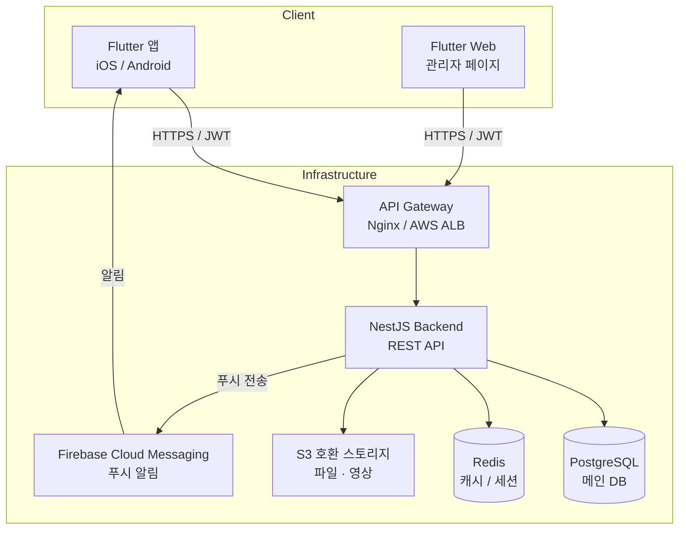
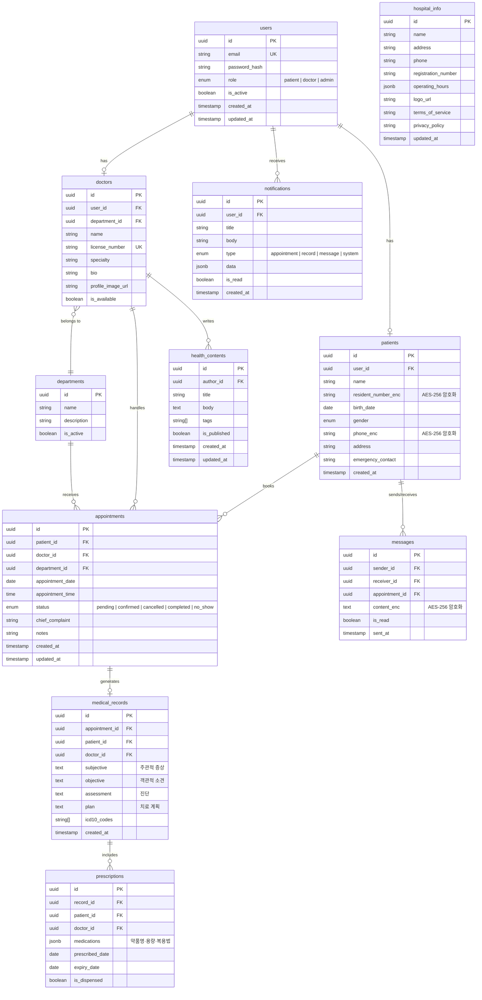

# 병원 앱 아키텍처

중소규모 병원(의사 5~30명)용 Flutter 앱 + 웹 관리 페이지의 시스템 아키텍처 문서입니다.
대면 예약 중심으로 설계되었으며, 한국 개인정보보호법(개인정보 보호법, 의료법)을 준수합니다.

---

## 기술 스택

| 영역 | 기술 | 채택 근거 |
|------|------|-----------|
| 모바일 앱 | Flutter | 크로스 플랫폼(iOS/Android) 단일 코드베이스, 빠른 개발 속도 |
| 관리자 웹 | Flutter Web | 앱과 코드 공유, 별도 프론트엔드 팀 불필요 |
| 백엔드 | NestJS (TypeScript) | 구조화된 모듈 시스템, 의존성 주입, REST/GraphQL 지원 |
| 데이터베이스 | PostgreSQL | 관계형 데이터 모델, 의료 데이터 무결성, ACID 보장 |
| 인증 | JWT + Refresh Token | Stateless 인증, 토큰 갱신으로 보안성과 UX 균형 |
| 푸시 알림 | Firebase Cloud Messaging (FCM) | iOS/Android 통합 푸시, 무료 티어로 중소 병원 적합 |
| 파일 스토리지 | S3 호환 (MinIO / AWS S3) | 의료 영상·문서 보관, MinIO로 온프레미스 선택 가능 |
| 캐시 | Redis | 세션 데이터, 예약 현황 캐싱, 토큰 블랙리스트 관리 |

---

## 시스템 구조



> **참고**: 관리자 웹(Flutter Web)과 모바일 앱(Flutter)은 동일한 백엔드 API를 사용합니다.
> 역할(RBAC)에 따라 접근 가능한 엔드포인트가 분리됩니다.

---

## DB 스키마 (주요 테이블)



---

## API 구조

모든 API는 `/api/v1` prefix를 사용합니다. HTTPS 필수이며 JWT Bearer 토큰으로 인증합니다.

### 인증 `/api/v1/auth/*`
| 메서드 | 경로 | 설명 | 권한 |
|--------|------|------|------|
| POST | `/auth/register` | 환자 회원가입 | Public |
| POST | `/auth/login` | 로그인 (JWT 발급) | Public |
| POST | `/auth/refresh` | Access Token 갱신 | Public |
| POST | `/auth/logout` | 로그아웃 (토큰 무효화) | 인증 필요 |
| POST | `/auth/password/reset` | 비밀번호 재설정 요청 | Public |
| PATCH | `/auth/password` | 비밀번호 변경 | 인증 필요 |

### 병원 정보 `/api/v1/hospitals/*`
| 메서드 | 경로 | 설명 | 권한 |
|--------|------|------|------|
| GET | `/hospitals/info` | 병원 기본 정보 | Public |
| GET | `/hospitals/departments` | 진료과 목록 | Public |
| GET | `/hospitals/doctors` | 의사 목록 | Public |
| GET | `/hospitals/doctors/:id` | 의사 상세 정보 | Public |
| PATCH | `/hospitals/info` | 병원 정보 수정 | admin |

### 예약 `/api/v1/appointments/*`
| 메서드 | 경로 | 설명 | 권한 |
|--------|------|------|------|
| GET | `/appointments` | 내 예약 목록 | patient/doctor |
| POST | `/appointments` | 예약 생성 | patient |
| GET | `/appointments/:id` | 예약 상세 | patient/doctor |
| PATCH | `/appointments/:id/status` | 예약 상태 변경 | doctor/admin |
| DELETE | `/appointments/:id` | 예약 취소 | patient |
| GET | `/appointments/slots` | 예약 가능 시간 조회 | patient |

### 환자 `/api/v1/patients/*`
| 메서드 | 경로 | 설명 | 권한 |
|--------|------|------|------|
| GET | `/patients/me` | 내 환자 정보 | patient |
| PATCH | `/patients/me` | 환자 정보 수정 | patient |
| GET | `/patients/:id` | 특정 환자 정보 | doctor/admin |
| GET | `/patients` | 환자 목록 | doctor/admin |

### 진료 기록 `/api/v1/records/*`
| 메서드 | 경로 | 설명 | 권한 |
|--------|------|------|------|
| GET | `/records` | 내 진료 기록 목록 | patient/doctor |
| POST | `/records` | 진료 기록 작성 | doctor |
| GET | `/records/:id` | 진료 기록 상세 | patient/doctor |
| GET | `/records/:id/prescription` | 처방전 조회 | patient/doctor |

### 메시지/알림 `/api/v1/messages/*`
| 메서드 | 경로 | 설명 | 권한 |
|--------|------|------|------|
| GET | `/messages` | 메시지 목록 | 인증 필요 |
| POST | `/messages` | 메시지 전송 | 인증 필요 |
| PATCH | `/messages/:id/read` | 읽음 처리 | 인증 필요 |
| GET | `/messages/notifications` | 알림 목록 | 인증 필요 |

### 관리자 `/api/v1/admin/*`
| 메서드 | 경로 | 설명 | 권한 |
|--------|------|------|------|
| GET | `/admin/dashboard` | 대시보드 통계 | admin |
| GET | `/admin/users` | 전체 사용자 목록 | admin |
| PATCH | `/admin/users/:id/status` | 사용자 상태 변경 | admin |
| POST | `/admin/doctors` | 의사 계정 생성 | admin |
| GET | `/admin/appointments` | 전체 예약 현황 | admin |
| POST | `/admin/contents` | 건강 정보 게시 | admin/doctor |

---

## 인증/보안 설계

### JWT + RBAC 구조

```
Access Token  유효기간: 15분
Refresh Token 유효기간: 7일 (Redis에 저장, 로그아웃 시 즉시 무효화)

RBAC 역할:
  patient → 본인 예약/기록/메시지 접근
  doctor  → 담당 환자 기록 조회, 진료 기록 작성, 예약 관리
  admin   → 전체 데이터 접근, 병원 설정, 사용자 관리
```

### 의료 데이터 암호화

| 대상 데이터 | 암호화 방식 | 비고 |
|-------------|------------|------|
| 주민등록번호 | AES-256-GCM | 컬럼 레벨 암호화, 키는 환경변수 관리 |
| 전화번호 | AES-256-GCM | 검색 위해 해시값 별도 저장 |
| 메시지 내용 | AES-256-GCM | 전송 시 암호화, DB 저장도 암호화 상태 유지 |
| 진료 기록 | TLS(전송) + PostgreSQL row-level security | 스토리지 레벨 암호화 추가 |
| 비밀번호 | bcrypt (cost factor 12) | 단방향 해시 |

### 개인정보보호법 준수 포인트

1. **개인정보 수집·이용 동의**: 회원가입 시 명시적 동의 (목적, 항목, 보유 기간 명시)
2. **최소 수집 원칙**: 서비스에 필수적인 정보만 수집, 선택 항목 구분
3. **보유 기간 관리**: 의료법 기준 진료 기록 10년 보관, 이후 자동 삭제 스케줄러
4. **접근 권한 분리**: 담당 의사만 환자 기록 접근 (Row Level Security)
5. **개인정보 처리방침**: 앱 내 열람 가능, 변경 시 재동의
6. **개인정보 이동권**: 환자 본인의 데이터 내보내기(JSON/PDF) 기능 제공
7. **파기 요청 처리**: 회원 탈퇴 시 식별 정보 즉시 파기, 의료 기록은 법정 기간 후 파기
8. **접속 로그 보관**: 개인정보 접근 로그 2년 이상 보관 (감사 추적)

### 보안 필수 사항

- **HTTPS 전용**: HTTP → HTTPS 리다이렉트, HSTS 헤더 설정
- **Rate Limiting**: 로그인 시도 IP당 5회/분 제한
- **Input Validation**: NestJS `class-validator`로 모든 입력값 검증
- **SQL Injection 방지**: TypeORM Parameterized Query 사용
- **XSS 방지**: Flutter는 웹뷰 최소화, 관리자 웹 CSP 헤더 설정
- **감사 로그**: 의료 기록 조회/수정 시 자동 로그 기록

---

## 프로젝트 폴더 구조

### Flutter 앱 (`lib/`)

```
lib/
├── main.dart
├── app.dart                    # MaterialApp, 라우팅 설정
├── core/
│   ├── constants/              # API URL, 앱 설정 상수
│   ├── errors/                 # 커스텀 예외 클래스
│   ├── network/                # Dio 클라이언트, Interceptor
│   ├── storage/                # SecureStorage (토큰), SharedPreferences
│   ├── utils/                  # 날짜 포맷, 암호화 유틸
│   └── widgets/                # 공통 위젯 (Button, LoadingOverlay 등)
├── features/
│   ├── auth/
│   │   ├── data/               # AuthRepository, AuthAPI
│   │   ├── domain/             # AuthUseCase, User 모델
│   │   └── presentation/       # LoginPage, RegisterPage
│   ├── appointment/
│   │   ├── data/
│   │   ├── domain/
│   │   └── presentation/       # AppointmentListPage, BookingPage
│   ├── record/
│   │   ├── data/
│   │   ├── domain/
│   │   └── presentation/       # RecordListPage, RecordDetailPage
│   ├── message/
│   │   ├── data/
│   │   ├── domain/
│   │   └── presentation/       # MessagePage, NotificationPage
│   ├── profile/
│   │   └── presentation/       # ProfilePage, SettingsPage
│   └── home/
│       └── presentation/       # HomePage, BottomNav
└── l10n/                       # 다국어 (ko, en)
```

> **상태관리**: Riverpod 사용 권장 (테스트 용이성, 코드 생성 지원)
> **라우팅**: GoRouter (딥링크, 웹 URL 지원)
> **아키텍처**: Feature-first + Clean Architecture (data/domain/presentation)

### NestJS 백엔드 (`src/`)

```
src/
├── main.ts                     # 앱 진입점, Swagger 설정
├── app.module.ts               # 루트 모듈
├── config/                     # 환경변수 설정 (ConfigModule)
├── common/
│   ├── decorators/             # @CurrentUser, @Roles 등
│   ├── guards/                 # JwtAuthGuard, RolesGuard
│   ├── interceptors/           # LoggingInterceptor, TransformInterceptor
│   ├── filters/                # GlobalExceptionFilter
│   ├── pipes/                  # ValidationPipe 설정
│   └── utils/                  # 암호화, 날짜 유틸
├── modules/
│   ├── auth/
│   │   ├── auth.module.ts
│   │   ├── auth.controller.ts
│   │   ├── auth.service.ts
│   │   ├── strategies/         # JwtStrategy, LocalStrategy
│   │   └── dto/
│   ├── hospital/
│   │   ├── hospital.module.ts
│   │   ├── hospital.controller.ts
│   │   └── hospital.service.ts
│   ├── appointment/
│   ├── patient/
│   ├── doctor/
│   ├── record/
│   ├── message/
│   ├── notification/
│   └── admin/
├── database/
│   ├── entities/               # TypeORM 엔티티
│   ├── migrations/             # DB 마이그레이션
│   └── seeds/                  # 초기 데이터
└── jobs/                       # 스케줄러 (예약 알림, 데이터 파기)
```

---

## MVP vs 확장 계획

### Phase 1 - MVP 아키텍처 (단순, 빠른 출시)

**목표**: 핵심 예약 기능만으로 3개월 내 출시

```
구성:
  Flutter 앱 (모바일)
  NestJS 백엔드 (단일 서버)
  PostgreSQL (단일 인스턴스)
  Redis (토큰 관리, 간단한 캐시)
  FCM (푸시 알림)
  AWS S3 or MinIO (파일 저장)
  Nginx (리버스 프록시, SSL)

포함 기능:
  - 회원가입/로그인
  - 예약 생성/조회/취소
  - 의사·진료과 정보 조회
  - 진료 기록 조회 (읽기 전용)
  - 푸시 알림 (예약 확인, 리마인더)
  - 관리자 웹 (Flutter Web, 기본 대시보드)

제외 기능:
  - 실시간 메시징 (문자 알림으로 대체)
  - 처방전 전자 발급
  - 의료 영상 뷰어
```

### Phase 2 - 기능 확장 (4~6개월 후)

```
추가 컴포넌트:
  WebSocket (NestJS Gateway) → 실시간 채팅/알림
  Elasticsearch → 환자/기록 전문 검색
  Bull Queue (Redis) → 비동기 작업 (알림 일괄 발송, 리포트 생성)

추가 기능:
  - 의사-환자 실시간 메시지
  - 처방전 QR 코드 발급
  - 건강 정보 콘텐츠
  - 통계 대시보드 (예약율, 환자 현황)
  - 카카오 알림톡 연동
```

### Phase 3 - 고도화 (1년 후)

```
추가 컴포넌트:
  읽기 전용 DB Replica → 조회 성능 분리
  CDN → 의료 콘텐츠·이미지 캐싱
  OpenTelemetry + Grafana → 모니터링/APM

추가 기능:
  - 의료 영상(DICOM) 뷰어 연동
  - 보험 청구 연계 (EDI)
  - 다중 병원 지점 지원
  - 환자 설문/만족도 조사
  - 모바일 건강 데이터 연동 (Apple Health, Google Fit)
```

---

## 관련 노트

- [[1. Projects/병원-앱/병원-앱-프로젝트-허브]]
